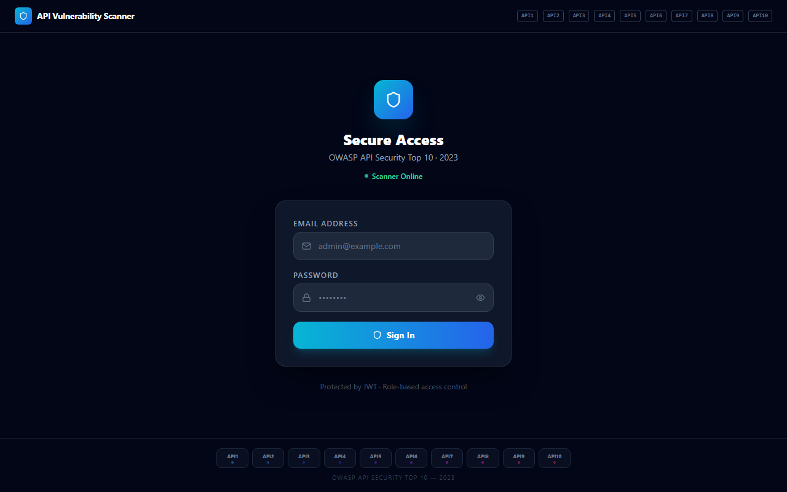
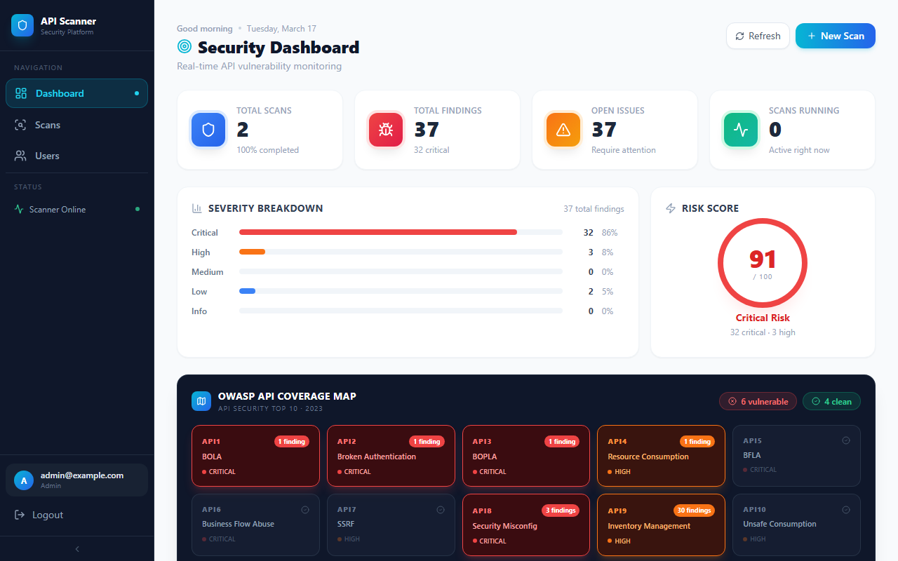
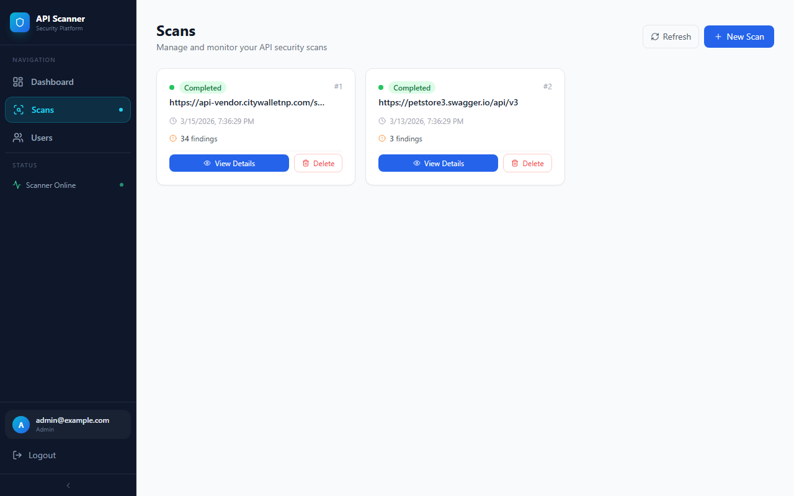
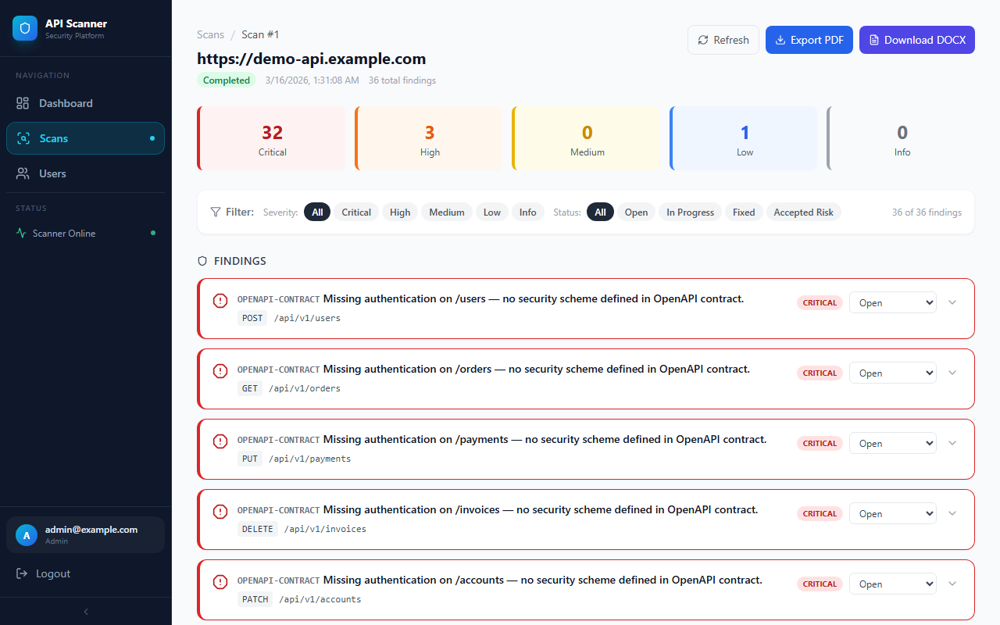
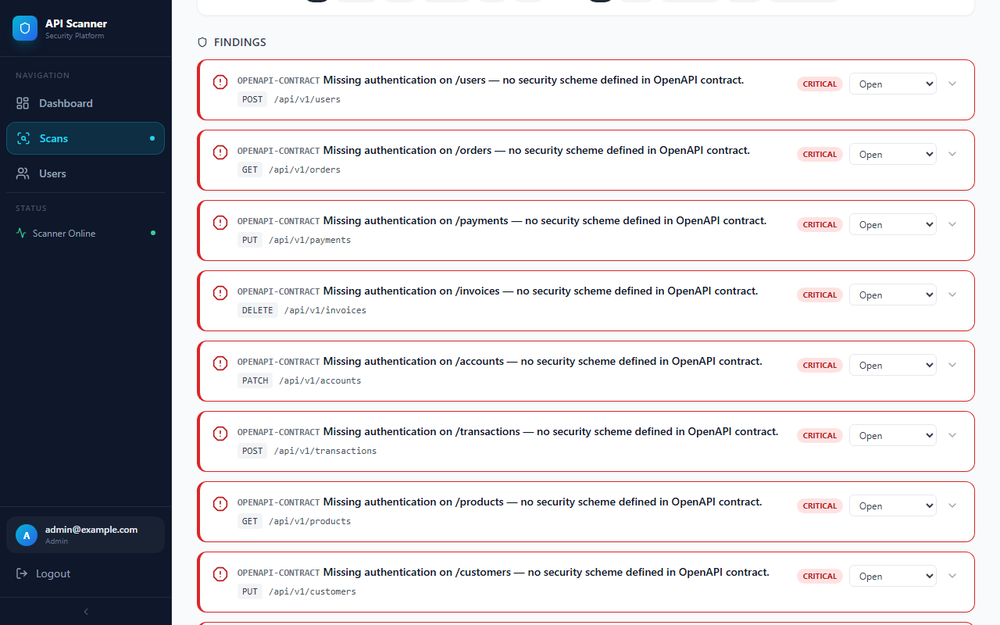
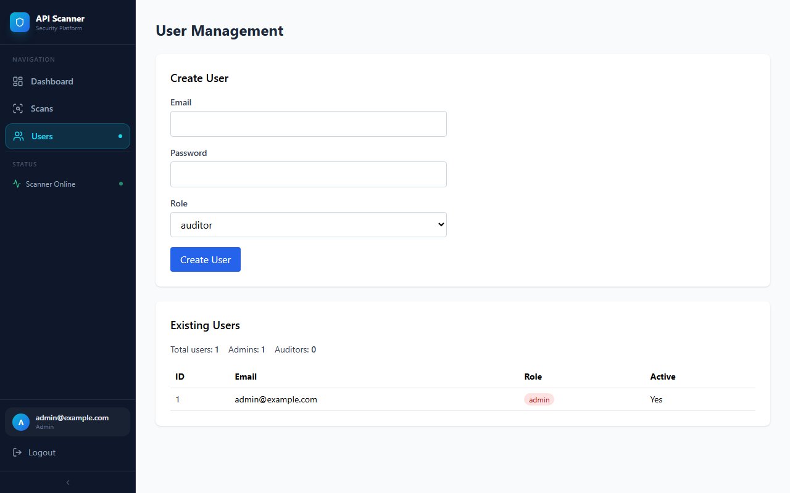

# 🔐 API Security Scanner

OWASP-focused API security scanner built with FastAPI and React.


It performs static analysis of OpenAPI contracts and dynamic checks against live APIs, then presents findings in a web dashboard with exportable PDF and DOCX reports.

---

## 📸 Screenshots

### Login — Cybersecurity Theme
> Dark-themed login with OWASP API Top 10 tag bar, shield branding, and JWT-protected authentication



---

### Security Dashboard
> Real-time metrics: total scans, findings, severity breakdown, risk score gauge, and interactive OWASP API Coverage Map



---

### Scans List
> All past scans with completion status, timestamps, and per-scan finding counts



---

### Scan Detail — Findings
> Severity summary boxes, filter bar (by severity and triage status), and paginated findings list with rule badges and endpoint paths



---

### Findings — Scrolled View
> Each finding shows the HTTP method, full endpoint path, severity badge, and inline triage status dropdown



---

### User Management
> Admin-only page to create auditor/admin accounts and view existing users with role badges



---

## ⚙️ Features

- 🧭 OWASP API Top 10–oriented checks
- 📄 OpenAPI contract analysis:
  - Missing or weak authentication on endpoints
  - Unrestricted file uploads
  - PII exposure in request/response schemas
- 🛰️ Dynamic checks against a live target API:
  - Security headers and CORS misconfiguration
  - Rate limiting and resource consumption
  - BOLA / IDOR attempts by modifying object identifiers
  - Business-logic checks against sensitive flows (payments, orders, checkouts)
  - Fuzzing-based robustness tests for query parameters and JSON bodies
  - Error-based indicators of unsafe deserialization
  - Sensitive data patterns in responses (emails, SSNs, API keys, etc.)
  - JWT algorithm confusion (e.g. `alg: none` bypass)
  - Mass assignment via unprotected writeable fields
  - TLS enforcement (HTTP vs HTTPS / redirects)
  - Cookie security flags (HttpOnly / Secure / SameSite)
  - Fingerprinting headers (e.g. `Server`, `X-Powered-By`)
- 📊 Dashboard:
  - Real-time metrics (total scans, findings, open issues)
  - Severity breakdown with weighted risk score (0–100)
  - Interactive OWASP API Coverage Map grid
  - Recent scans summary
- 🔎 Scan detail:
  - Per-finding severity, rule ID, endpoint, and HTTP method
  - Inline triage status (Open / In Progress / Fixed / Accepted Risk)
  - Filter by severity and status
- 🧾 Report export:
  - **PDF** — multi-page professional report with cover page, severity summary, OWASP coverage table, and per-finding detail sections
  - **DOCX** — structured Word document with colour-coded severity rows
- 🔐 Basic authentication and roles (admin vs auditor)
- 👥 Multi-user management UI for creating admin/auditor accounts
- 🛡️ Optional HTTPS reverse proxy via Nginx with TLS

---

## 🧱 Tech Stack

| Layer | Technologies |
|---|---|
| Backend | FastAPI · SQLAlchemy · Uvicorn · SQLite (dev) / PostgreSQL (Docker) |
| Frontend | React + Vite · React Router v6 · TanStack Query · Axios · Tailwind CSS · Lucide icons |
| Reports | jsPDF + jspdf-autotable (PDF) · python-docx 1.x (DOCX) |
| Container | Docker · Docker Compose · Nginx (HTTPS reverse proxy) |

---

## 📁 Project Structure

```
api-security-scanner/
├── backend/
│   └── app/
│       ├── main.py                        # FastAPI entrypoint
│       ├── api/api_v1/endpoints/          # login · users · scans endpoints
│       ├── scanner/
│       │   ├── engine.py                  # Rule orchestration
│       │   └── rules/                     # Individual scanning rules
│       ├── models/                        # SQLAlchemy ORM models
│       ├── schemas/                       # Pydantic I/O schemas
│       └── core/config.py                 # App configuration
├── frontend/
│   └── src/
│       ├── App.jsx                        # Routing + sidebar layout
│       ├── api.js                         # Axios client
│       └── pages/                         # Login · Dashboard · Scans · ScanDetail · Users
├── docs/screenshots/                      # README screenshots
├── scripts/                               # Dev utilities (seed data, screenshot capture)
├── docker-compose.yml
└── nginx.conf
```

---

## 🚀 Getting Started (Local Development)

### 1. Clone the repository

```bash
git clone https://github.com/3tternp/api-security-scanner.git
cd api-security-scanner
```

### 2. Backend (FastAPI)

```bash
cd backend

# Create and activate a virtual environment
python -m venv .venv

# Windows PowerShell
.venv\Scripts\Activate.ps1
# Linux / macOS
# source .venv/bin/activate

pip install --upgrade pip
pip install -r requirements.txt

# Initialise the database (and create the first admin if ADMIN_EMAIL / ADMIN_PASSWORD are set)
python -m app.initial_data

# Start the API server
uvicorn app.main:app --host 0.0.0.0 --port 8001 --reload
```

API is available at `http://localhost:8001/api/v1`

### 3. Frontend (React + Vite)

```bash
cd frontend
npm install

# Point the frontend at the local backend (optional, default is http://localhost:8000/api/v1)
# Windows PowerShell:
#   $env:VITE_API_URL="http://localhost:8001/api/v1"
# Linux / macOS:
#   export VITE_API_URL="http://localhost:8001/api/v1"
npm run dev
```

Frontend runs at `http://localhost:5173`

### 4. Log in

Log in with the admin account you created:
- If you set `ADMIN_EMAIL` / `ADMIN_PASSWORD` in `.env`, use those credentials.
- Otherwise create the first admin via the Setup page in the UI (first run only).

> ⚠️ Change these credentials before deploying to any shared environment.

---

## 🐳 Getting Started (Docker)

### Prerequisites

- Docker and Docker Compose

### 1. Clone and configure

```bash
git clone https://github.com/3tternp/api-security-scanner.git
cd api-security-scanner
```

### 2. (Optional) Generate self-signed TLS certificates for HTTPS

```bash
mkdir certs
openssl req -x509 -nodes -days 365 \
  -newkey rsa:2048 \
  -keyout certs/server.key \
  -out certs/server.crt \
  -subj "/CN=localhost"
```

### 3. Build and run

```bash
# Run without the HTTPS reverse proxy (recommended for local development)
docker compose up --build db backend frontend

# If you're using the standalone docker-compose binary:
# docker-compose up --build db backend frontend
```

| Service | Description |
|---|---|
| `backend` | FastAPI API on port 8000 (internal) |
| `frontend` | React app on port 5173 |
| `reverse-proxy` | Nginx TLS termination on port 443 (optional; enable via Compose profile `tls`) |
| `db` | PostgreSQL (when configured) |

Access the app:
- Direct frontend: `http://localhost:5173/`
- Via HTTPS (optional): create certs, then run `docker compose --profile tls up --build` and open `https://localhost/` *(accept the self-signed cert)*

---

## 📊 Usage

1. Log in using the admin credentials you configured in `.env` (`ADMIN_EMAIL` / `ADMIN_PASSWORD`) or created via the Setup page.
2. Go to **Scans → New Scan** and provide:
   - Target URL (e.g. `https://api.example.com`)
   - Optional OpenAPI spec URL or JSON file upload
   - Optional auth: Bearer token or Basic credentials
3. Start the scan and monitor its status (Running → Completed / Failed).
4. Open the scan to view findings:
   - Filter by severity (Critical / High / Medium / Low / Info)
   - Filter by triage status (Open / In Progress / Fixed / Accepted Risk)
   - Update each finding's status inline
5. Export a **PDF** or **DOCX** report for audit or sharing.
6. Delete old scans from the Scans list.
7. *(Admin only)* Go to **Users** to create additional admin or auditor accounts.

---

## 🔬 Demo: Scan a Local Vulnerable API

### 1. Start the scanner backend and frontend

```bash
# Terminal 1 — backend
cd backend && uvicorn app.main:app --host 0.0.0.0 --port 8001

# Terminal 2 — frontend
cd frontend && npm run dev
```

### 2. Start a demo vulnerable API

Create a `demo_api.py` (outside this project) with intentionally weak endpoints, then run:

```bash
uvicorn demo_api:app --host 0.0.0.0 --port 9002
```

Confirm it's running at:
- Swagger UI: `http://localhost:9002/docs`
- OpenAPI spec: `http://localhost:9002/openapi.json`

### 3. Run a scan from the UI

1. Open `http://localhost:5173/` and log in.
2. **Scans → New Scan**
3. Fill in:
   - Target URL: `http://localhost:9002`
   - OpenAPI Spec URL: `http://localhost:9002/openapi.json`
4. Click **Start Scan** and wait for completion.
5. View findings in the scan detail page.

Expected findings from a vulnerable demo API:
- Business-logic checks on sensitive POST flows
- Fuzzing-induced 5xx errors on malformed inputs
- Deserialization indicators in error messages

---

## 🧪 CI Examples

| Platform | File | What it does |
|---|---|---|
| GitHub Actions | `.github/workflows/ci.yml` | Backend compile check + frontend `npm run build` |
| GitLab CI | `.gitlab-ci.yml` | Backend stage (Python) + frontend stage (Node) |

---

## 🔒 Security Notes

- The default credentials (`admin@example.com` / `admin123`) are for local and demo use **only**. Change them before deploying.
- Do not expose this tool to the internet without:
  - Strong authentication and access control
  - HTTPS (TLS) termination
  - Network hardening (firewalls, WAF)
- Some dynamic checks send multiple HTTP requests (e.g. rate-limit probing). **Do not run against production systems** without coordination.

---

## 🧭 Roadmap Ideas

- Deeper workflow modeling and stateful multi-step test scenarios
- Additional SSRF and outbound-call abuse heuristics
- Fuzzing of file uploads and multipart endpoints
- Visualisations of cross-scan trends and risk scoring over time
- SAML / SSO support for enterprise deployments

---

## 📜 License

This project is licensed under the MIT License – see the [LICENSE](LICENSE) file for details.
